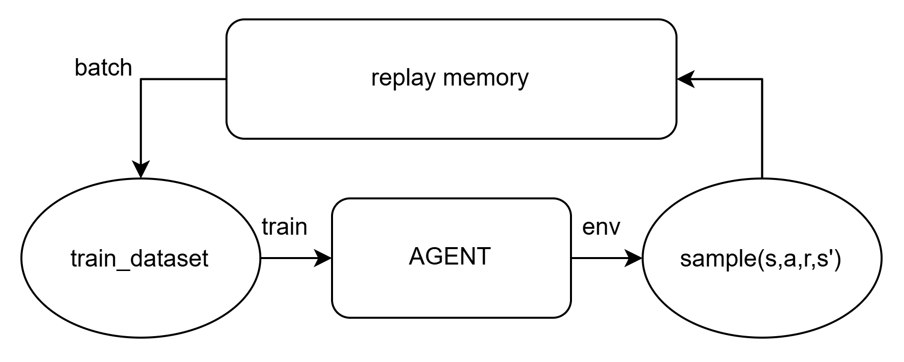
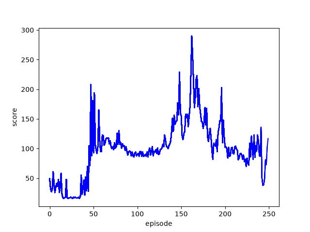
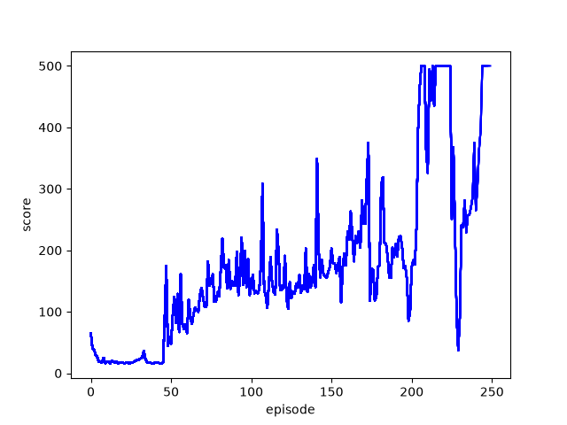
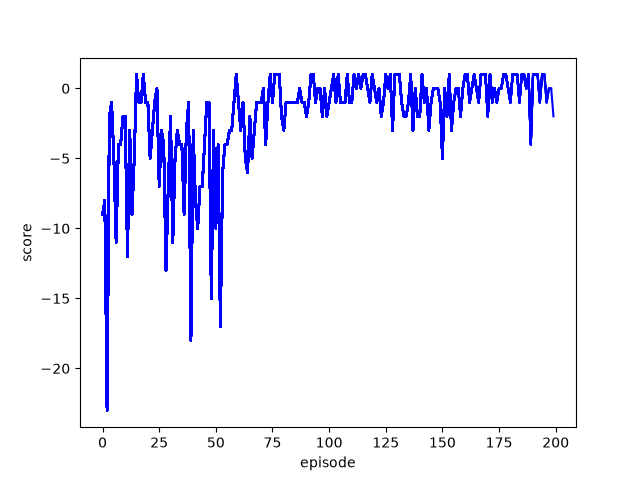

# DQN

Deep Q-Network로써, Q-Learning(off-policy)기법을 NN으로 구현한 알고리즘

## Q-Learning (Temporal-difference off-policy Control)

SARSA와 동일하게 TD제어 방식 중 하나이며, 환경에서는 $S_t, A_t, R_{t+1}, S_{t+1}$에 대한 샘플만 구하여, 학습에 사용하는 TD 알고리즘이다.

### SARSA의 문제점

기존 시간차 제어(SARSA) 방식에는 $S_{t+1}$의 Q함수값이 $\alpha$만큼$S_t$에 on-policy로 반영된다는 점이다.

이는 $Q(S_{t+1},A_{t+1})$이 $\epsilon$-탐욕정책 중 $\Pi_\theta (S) \rightarrow a \neq a^* (P = \epsilon)$ 으로 인해 원치 않은 action을 취해, penalty를 받아 $Q(S_{t+1}, A_{t+1}) < 0$이 되는 경우이다. 이렇게 되면, $Q(S_t,A_t) < 0$이 되므로, 탐험을 원활이 할 수 없고, 자칫하면 loop가 생길 수 있다. 하지만 $\epsilon$-탐욕 정책이 아닌, 탐욕 정책시에 모든 상태에 대한 탐험을 할 수 없다. 이는 최적의 해를 찾지 못하는 문제로 연결된다.

### Q-Learning을 통한 보완점

off-policy 방식이란, 탐험을 통해 얻은 **행동정책**과 실제로 학습시 사용하는 **목표정책**을 분리시킨다는 것이다. 행동정책은 기존 SARSA와 동일하게, $\epsilon$-탐욕정책이다. 목표정책은 $Q(S_{t+1}, A_{t+1})$를 바로 반영시키는 것이 아닌, $S_{t+1}$상태에서 가능한 모든 $Q(S_{t+1}, A_{t+1})$에 대하여, $max_{a'}Q(S_{t+1}, a')$을 구하는 것이다. 따라서 아래의 식으로 Q함수 업데이트 알고리즘을 표현할 수 있다.

$$
Q(S_{t}, A_{t}) \leftarrow Q(S_{t}, A_{t}) + \alpha (R_{t+1} + \gamma max_{a'}Q(S_{t+1}, a') - Q(S_{t}, A_{t}))
$$

따라서 Q함수의 Bellman Optimal Equation은 아래와 같이 정의할 수 있다.

$$
q^{*}(s,a) = r(s,a)+\gamma P^{a}_{ss'}\max_{a'}q^{*}(s', a')
$$

## Algorithm

DQN은 Q-Learning을 이용하며, 대표적으로 2가지의 algorithm을 가진다.

### 1. Experience Replay

Q-Learning에서는 off-policy방식을 $R_{t+1} + \gamma \max_{a'}Q(S_{t+1},a')$의 값을 target(목표)으로 사용하여 표현했다면, DQN은 **replay memory**에 agent가 환경으로부터 얻은 sample들을 저장해 두었다가, mini-batch의 형식으로 train_data_set을 추출하여, 학습하고, 출력된 값들 중 $\max(fout(x))$을 선택하는 방식으로 표현했다. 아래는 replay memory를 사용하는 agent의 과정을 대략적으로 표현한 그림이다.



이때 replay memory에 얼마나 많은 sample을 저장할 것이고, 언제부터 학습을 진행할 건지에 대해 hyper params를 제어할 수 있다. 초기의 sample들로는 모델의 가중치가 과대적합될 수 있어, 적절한 hyper params를 선택해야 한다.

### 2. target network

DQN은 기존 monte-carlo-policy-gradient방식과 달리 TD로 가중치를 업데이트 하기 때문에, bootstrapping의 문제점인 업데이트의 target(목표)가 계속 변동된다는 점이다. 따라서 이를 해결하기 위해 target은 기존 agent의 모델의 신경망이 아닌, 새로운 target network를 기반으로 값을 계산한다. 따라서, 목표값은 과거의 정책인 $\Pi_{\theta'}$을 토대로 상태에 따른 Q함수의 값을 계산한다. 그래서 현재 정책을 $\theta$, 과거정책을 $\theta'$라고 표현하여, 문제를 해결할 수 있다.

$$
Q(S_t,A_t,\theta) \leftarrow Q(S_t,A_t,\theta) + \alpha (R_t + \gamma \max_{a'}Q(S_{t+1},A_{t+1},\theta') - Q(S_t,A_t,\theta))
$$

따라서 학습을 위해 MSE loss값이 아래 수식이라고 해석할 수 있다.

$$
MSE = (R_t + \gamma \max_{a'}Q(S_{t+1},A_{t+1},\theta') - Q(S_t,A_t,\theta))^2
$$

### 3. plus. basic knowledge

DQN을 하며, 여러가지 모델 형태, 그에따른 여러가지 정책기법들이 혼동스러울 수 있어, 필자가 어려웠던 부분을 따로 정리해두겠다.

#### 1. NN vs Table

고전 방식 Table 같은 경우 상태에 따른 Q함수의 값을 독립적으로 저장할 수 있었다. 하지만 하나의 상태 $S_1$에 대해 NN weight 업데이트 시, 모든 상태함수가 같은 모델의 weight를 공유하고 있어, 다른 상태들에 영향을 끼치게 된다. 이는 독립적으로 상태에 따른 Q함수값을 저장할 수 없는 NN의 문제점이다.

#### 2. Bootstrapping

위에서 NN은 독립적으로 상태에 따른 Q함수값을 저장할 수 없다는 것을 알게 되었다. 이는 하나의 상태 $S_1$이 업데이트 시, 모든 상태 $S_i$ 들이 기존 $Q_i$에 대응되지 않고, 바뀐 weight들로 계산된 $Q_i'$과 대응된다는 것이다. 이는 target(목표)의 값이 증폭되어, 기존의 값과 오차가 생기게 되며, 상태 $S_t$ 에서는 증폭된 값과 같아지기 위해, 업데이트를 할 것이다. 이 악순환이 반복되어, 발산할 수 있다. 수식으로 표현하면 아래와 같이 나타낼 수 있다.

$$
Q(S_{t+1},A_{t+1},\theta) \neq Q(S_{t+1}, A_{t+1}, \theta')
$$

$$
\theta : weight\ 업데이트\ 후\ 새로운 정책,\ \theta : weight\ 업데이트\ 전\ 기존\ 정책
$$

target network는 기존 정책을 새로운 모델의 가중치에 버퍼와 같이 복사하여, target(목표)의 Q함수 값만 기존 정책 모델을 사용하여 구한다. 이 외에도 Bootstrapping을 막기 위한 방법들이 많이 존재한다.

#### 3. On-policy vs Off-policy

그러면 on-policy 방식에서는 bootstrapping을 사용하여 똑같이 target network를 구성해야 하나?
결론적으로는 거의 고려하지 않아도 된다. on-policy의 경우 SARSA이므로 $Q(S_t,A_t)$를 탐색하는 만큼 $Q(S_{t+1}, A_{t+1})$ 도 탐색하여 weight를 업데이트 한다. 따라서 $S_{t+1}$ 상태에서도 비슷한 빈도로 값을 업데이트하기 때문에, $S_t$와 $S{t+1}$에서의 weight 업데이트 빈도 차이가 나는 off-policy는 달리 bootstrapping으로 생기는 오차 증폭 문제점은 거의 고려 안해도 된다. 추가로 MC 방식은 episode가 끝날때 까지 weight를 업데이트 하지 않으므로, bootstrapping이 아니므로, 신경 쓸 필요도 없다.

## Environment - CartPole

input으로 넣는 정보(MDP)는 아래와 같이 구상하였다.

1. cart 위치 (x)
2. cart 속도 (x')
3. pole 각도 ($\theta$) 지표면과 수직선과의 각도이다.
4. pole 각속도 ($\theta'$)

cartpole의 경우 행할 수 있는 action은 [왼쪽, 오른쪽] 2가지 밖에 없다. 각 action에 대한 값어치를 NN모델의 출력값으로 해석하면 된다.

## Code

### 1. init

epsilon, epsilon_decay, epsilon_min, lr, discount_factor, train_start, model, optim

#### 1-1. Epsilon

epsilon-policy 를 토대로, 확률에 따라 행해야 할 action이 아닌 랜덤한 action을 취하도록 하였다. 이를 사용하여, 최적의 해를 찾기 위해 환경을 모두 지각하여야 하는 문제를 해결할 수 있다. 하지만 cartpole에서는 행하는 action이 2가지 밖에 없으므로, 크게 영향이 있는 param는 아니다.

또한 epsilon_decay 변수를 통해, 변동성 감쇠를 주어, episode가 진행될 수록 정책에 의존하여 움직이도록 설정하였다.

```py
if self.epsilon > self.epsilon_min:
    self.epsilon *= self.epsilon_decay
```

#### 1-2. discount_factor

할인율로써, 벨만 방정식에서 $r$ 부분이다. MDP(Markov Decision Process) 에서 보상 획득 시간을 구별하기 위해 넣은 개념이다.

#### 1-3. train_start

앞서 말한 DQN의 특징 중 하나인 replay memory에 대한 param이다. 코드로는 아래와 같이 구현할 수 있다.

```py
replay_memory = deque(maxlen=3000) # 최대로 저장하는 sample수
...
if len(agent.replay_memory) >= agent.train_start:
    agent.train_model()
```

---

### 2. model

fully-connect layer로 node 25개씩 2 layer로 구현하였다.
마지막 output은 Q-function 의 값을 판단해야 하니, action_size로 출력하도록 하였고, 각각의 activation-function은 relu로 구현하였다.

이때 각 action에 대한 policy를 출력하는 것이 아닌, Q-function의 값을 최적의 Q-function값으로 근사시키기 위한 모델인 것을 참고해야 한다.

또, 마지막 layer에 softmax activate function 등을 사용하게 되면, Q함수값의 크기에 대한 정보가 사라져, 학습이 느려지거나 안된다.

```py
def __init__(self, len_a):
    super(DQN, self).__init__()
    self.fc1 = Dense(25, activation="relu")
    self.fc2 = Dense(25, activation="relu")
    self.fout = Dense(len_a)  # activation="softmax"

def call(self, s):
    x = self.fc1(s)
    x = self.fc2(x)
    return self.fout(x)
```

---

### 3. optimizer

Adam을 사용하였다.

### 4. env

현재의 코드는 gym에서 제공하는 env를 통해 구현하였다. 하지만 실제로 stepping motor을 통해 구현하게 된다면 바람저항, 마찰력 등을 고려해야 할 것이다. 추후 env를 직접 만들어, pole의 길이 및 질량에 따른 저항값들을 적용 시켜보겠다.

### 5. target network sync(update)

현재의 코드는 아래와 같이 episode가 끝나야, 실제 모델의 weight를 target(목표) 전용 모델에 update를 해준다. 하지만 episode 한개의 길이가 길어지거나, episode가 끝나지 않는 환경이라면, step을 지정해주고, step마다 동기화를 해주어야 한다.

```py
if done:
    agent.update_target_model()
...
self.sync_step = 1000 # 추후 기능 보강 예정
```

## 결과

### Train


맨 처음에는 epsilon = 1이므로 완전 랜덤한 상태로 움직이지만, sample이 1000개 모이고 난 후, 학습을 하여 무작위 움직임에서 점점 규칙성을 띄는것을 볼 수 있다. 현재 보이는 시뮬레이션 기준 약 80번 episode에서 오른쪽으로 안넘어지고 일정한 등속운동으로 pole을 세우는 것을 볼 수 있다. 하지만 env에서 시작지점 좌우 일정 거리 이상 벗어나는 것도 penalty를 부여하여, agent는 다시 왼쪽으로 가야만 하고, 이로 인해 움직임이 단기적으로 다시 불안정해지는 것을 볼 수 있다. 이렇듯, score을 높히 낼 수 있는 정책임에도 불구하고, 그 정책에 맞지 않는 상황이 올 것을 대비하는 것도 중요하다고 생각한다.

마치 계단을 올라갈 때, 첫 계단만을 바라보고 올라가기 위한 정책을 만들었는데, 두번째 계단을 예상하지 못하고, 다시 정책을 처음부터 짜느라 불안정해지는 느낌을 받았다. 귀엽지 않는가? ㅎ

### Test


학습한 weight대로 잘 움직이며, 모두 최대시간까지 유지한다. 추후 마우스와의 작용을 통해 물리력을 가했을 때, 복구력도 시험해 봐야겠다.

### Graph

<p>
  
  
  
</p>

각각 훈련에 대한 hyper params는 img alt로 붙였다. 맨 왼쪽은 학습이 제대로 안되어, 각각 episode에 대해 score가 하락하는 모습을 볼 수 있고, 중간과 맨 오른쪽은 같은 학습을 누적 유무로 다르게 표현해 보았다. 실제로 최대점수인 500점을 episode 후반에 계속 유지하는 것으로 보아, 학습이 잘 되는 것을 확인할 수 있다.
