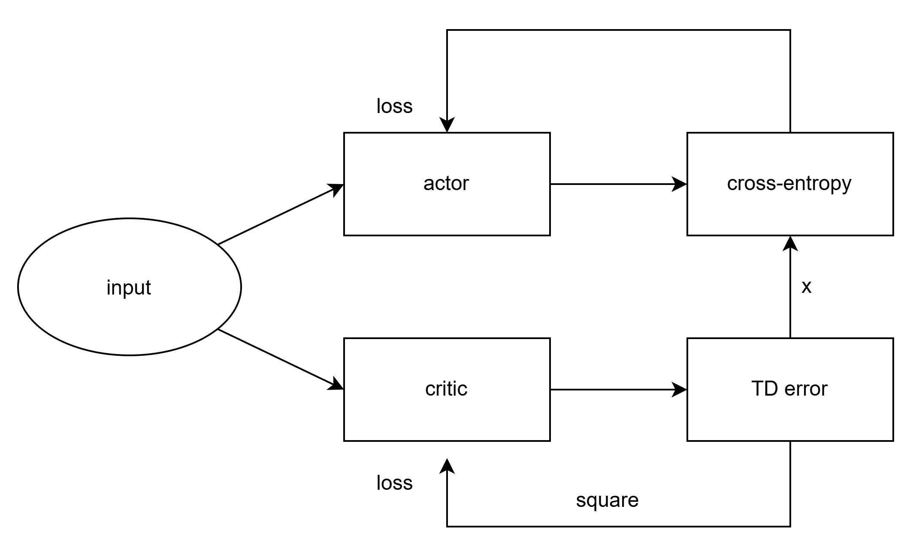
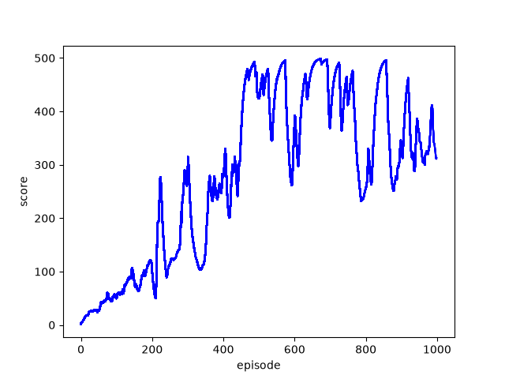
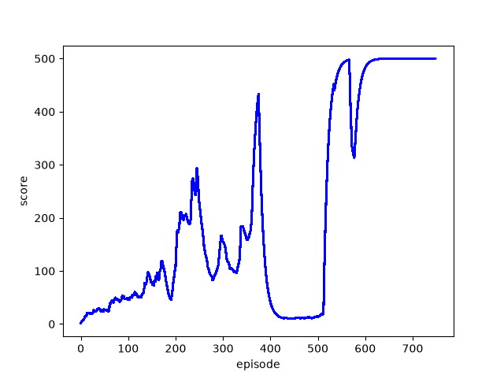
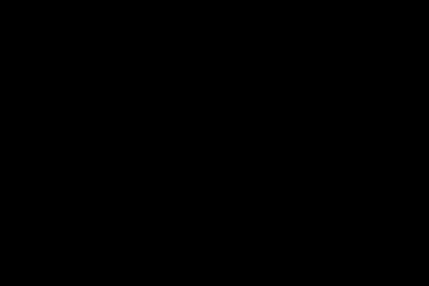
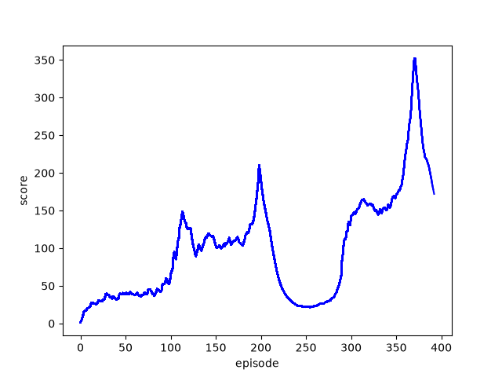
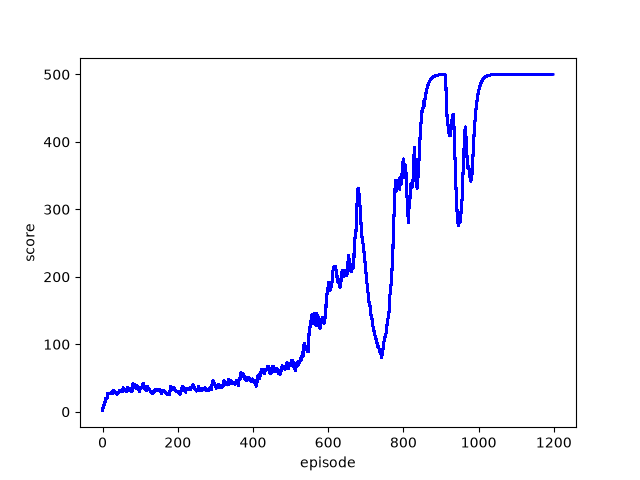

# Actor-Critic

policy-gradient 방식에서 Q함수를 critic인 가치 신경망으로 계산하여, 정책 발전을 하는 NN 강화학습 알고리즘

## Remark policy-gradient

상태에 따른 정책을 $\Pi_\theta(S_t)$라고 나타낼 때, 이의 목표는 $maximize J(\theta)$라고 표현할 수 있다. 그래서 각 시행에 따른 정책 발전을 아래와 같이 표현한다.

$$
\theta_{t+1} \approx \theta_t + \alpha (\nabla_\theta J(\theta))
$$

$$
\nabla_\theta J(\theta) = \Sigma_s d_{\Pi_\theta}(s) \Sigma_a \nabla_\theta \Pi_\theta(a | s)q(s,a)
$$

$$
\nabla_\theta J(\theta) = E[\nabla_\theta log\Pi_\theta(a|s) q(s,a)]
$$

$$
\theta_{t+1} = \theta_t + \alpha(\nabla_\theta log\Pi_\theta(a | s) q(s,a))
$$

이때 MC policy_gradient는 $q(s,a) \approx G_t$ 로 대체하여 정책발전을 했다.

## MC policy-gradient의 문제점

MC 방식은 bootstrapping 방식이 아니다. 이는 정책발전이 episode가 끝나야 진행된다는 것이며, 분산이 크다. episode 내에서 각 상태에 대해 편향이 전혀 없고, 분산이 커 학습이 불안정할 수 있다. 수식적으로는 $G_0 = R_{1} + \gamma R_{2} + ... + \gamma^{n-1} R_{n}$이며, episode의 끝인 n이 올때까지 기다렸다가, $G_{n-1} = R_n$을 하여$G_0$을 완성시킨다.

## Algorithm

actor-critic은 말 그대로 actor(policy network), critic(value network)로 2개의 신경망으로 정책을 발전시킨다. policy iteration에서 actor는 policy improvement, critic은 policy evaluation을 담당한다.



### 1. actor (policy network)

기존 policy-gradient와 동일하게 아래의 식을 기반으로 정책을 업데이트 한다.

$$
\theta_{t+1} = \theta_t + \alpha(\nabla_\theta log\Pi_\theta(a | s) q(s,a))
$$

cross-entropy를 loss로 가지며, 이 중 q(s,a)는 critic network의 출력이므로, critic의 값을 상태에 따른 정책의 로그에 곱하여 loss를 구한다.

### 2. critic (value network)

정책 발전식에서 $Q_w(S_t, A_t)$에 해당하는 부분이다. 이 Q함수를 여러가지 형태로 나타낼 수 있다.

$$
Q_w(S_t,A_t) = E[R_{t+1} + \gamma V_w(S_{t+1})]\ (기대값을 활용)
$$

$$
Q_w(S_t,A_t) = \Sigma_{(a^\prime, r)} P(a^\prime, r | a, s)(R(s^{\prime}) + \gamma V_{w}(s^{\prime}))\ (모델 전이 확률 포함)
$$

위의 식을 토대로 생각해봤을 때, 상태s에서의 Q함수는 아래 2가지의 가치에 영향을 받는다.

1. 상태 $s^{\prime}$의 가치
2. 행동 a의 가치

우선 예시를 하나 설명해보겠다. 상태 $s$와 $s^{\prime}$가 있다. 각각 a라는 동일한 행동을 통해 다음 상태로 넘어간다

$$
s=-100 \rightarrow^{a=+50} +50 \\
s^{\prime}=100 \rightarrow^{a=-100} 0
$$

행동 a에 대해서 +50는 -100에 대해 reward를 받아야 하는 것이 분명하다. 하지만 상태 s들에 대해 a의 정보가 삭제된다. 이로 인해 Q함수에서 행동 a의 가치가 더 중요하게 작용하는 문제일때, 분산이 증가하며, 필요한 학습량이 증가하게 된다.

그래서 우리는 policy-gradient에서 Q함수를 baseline를 빼주어, 행동 a의 가치가 드러나도록, 문제 해결의 분산을 줄여주도록 할 것이다. 이 방법을 advantage actor-critic이라 부른다. (A2C라고도 부른다)

# Advantage Actor-Critic

Actor-critic에서 critic network의 값인 Q함수의 상태 s에 의존하는 문제를 해결하기 위해 baseline으로 보정을 해준 advantage값으로 대체하여 정책 발전을 하는 NN 강화학습 알고리즘

## Algorithm

### 1. advantage ($\delta$)

$$
A_w(s,a) = Q_w(s, a) - V_w(s) \\
$$

$$
\delta_w = R_{t+1} + \gamma V_w(s^{\prime}) - V_w(s)
$$

위의 식대로 advantage는 기존 Q함수에 현재 상태가치함수 $V_w(s)$를 빼서 구할 수 있다. 그럼 왜 굳이 baseline을 현재 상태가치함수로 지정해야 할까?

#### 1. 행동 a에 의존하지 않는다.

이는 생각보다 중요한 문제이다. 만약 baseline이 행동a에 의존한다면 상태s에 대한 값을 보정하여, Q함수가 온전히 행동a에 대한 가치를 뽑아낼 수 있을 때, baseline의 값이 편향을 만들 수 있다. 분산을 줄이기 위해 보정을 하다, 오히려 편향이 생겨, 오차를 만들 수 있다.

#### 2. $V_\Pi(s)$를 사용하지 못하나?

현재 정책에 기반하는 상태가치함수를 토대로 baseline을 만들면, 더욱 효과적일 것이다. 하지만 모순적으로 현재 정책기반 상태가치함수를 유도하기 위해서는 현재 정책의 상태를 탐색해야 한다. 그러기 위해서는 **정책 평가**를 진행해야 하고, 그럴 수 없기 때문에, 임시적인 weight로 대체를 하는 것이다.

하지만 그래도 상관 없는 이유는, policy-iteration의 GPI로 인해 충분한 학습이 진행되면, $V_w(s) \approx V_\Pi(s)$ 로 근사되기 때문이다. 그래도 초기 값으로 인한 학습 오류를 막기 위해 초기값을 지정해주기도 한다.

```py
# model layer 선언시, 초기값 범위를 지정해주기도 한다
kernel_initializer=RandomUniform(-1e-3,1e-3)
```

### 2. TD error (시간차 오류)

$$
\delta_w(S_t,a) = R_{t+1} + \gamma V_w(S_{t+1}) - V_w(S_t)
$$

기존에 Temporal-difference를 다루면서, advange와 같은 수식을 시간차 에러로 나타내기도 했으며, $R_{t+1} + \gamma V_w(S_{t+1})$를 target으로 삼았었다. 이번 A2C algorithm도 똑같이 진행하여, MSE 형태로 loss를 표현할 것이다.

$$
\delta^{2}_{w}(S_t,a) = (R_{t+1} + \gamma V_w(S_{t+1}) - V_w(S_t))^2
$$

## Environment - CartPole (Discrete)

input으로 넣는 정보(MDP)는 아래와 같이 구상하였다.

1. cart 위치 (x)
2. cart 속도 (x')
3. pole 각도 ($\theta$) 지표면과 수직선과의 각도이다.
4. pole 각속도 ($\theta'$)

cartpole의 경우 행할 수 있는 action은 [왼쪽, 오른쪽] 2가지 밖에 없다. 각 action에 대한 값어치를 NN모델의 출력값으로 해석하면 된다.

## Code

### 1. init

lr, discount_factor, model, optim

### 2. model

fully-connect layer로 node 30개씩 2 layer로 구현하였다.

actor_model의 경우 output은 policy인 각 action의 확률을 출력한다. 이때, softmax를 취해, 각 확률의 합이 1이 되도록 했다.

critic_model의 경우 output은 advantage연산에 사용되는 value 하나이다. 그렇기 때문에 고정적으로 output_size = 1으로 설정했고, 선형 함수 그대로 출력한다. 현재 코드는 하나의 class 내에 있어서 가독성이 떨어질 수 있다. 이후 continuous A2C는 다른 class로 구현했다.

```py
def __init__(self, state_size, action_size):
    super(A2C, self).__init__()
    self.actor_model = nn.Sequential(
        nn.Linear(state_size, 30),
        nn.ReLU(),
        nn.Linear(30, action_size),
        nn.Softmax(dim=-1),
    )
    self.critic_model = nn.Sequential(
        nn.Linear(state_size, 30),
        nn.ReLU(),
        nn.Linear(30, 1),  # state value
    )

def forward(self, x):
    policy_list = self.actor_model(x)
    value_list = self.critic_model(x)

    return policy_list, value_list
```

### 3. optimizer

Adam을 사용하였다. 모델이 2개이므로, actor와 critic 두개를 만들어주었다.

```py
self.actor_optim = optim.Adam(
    self.model.actor_model.parameters(), lr=self.learning_rate
)
self.critic_optim = optim.Adam(
    self.model.critic_model.parameters(), lr=self.learning_rate
)
```

### 4. env

현재의 코드는 gym에서 제공하는 env를 통해 구현하였다.

```py
env = gym.make("CartPole-v1", render_mode="human")
env.unwrapped.metadata["render_fps"] = 2000
```

### 5. train_model

현재는 on-policy방식과 같이, 매 step마다 critic_model을 통해 value 값을 구하여, 정책 평가를 하고 있다. 이것을 TD(0)이라고도 칭하며, n-step의 $n=1$인 경우이다. 보통은 중간 값 $n$을 선정하며, $n=inf$이면 MC 방법이다. 이때 target은 $G_t$가 되는거다. loss 연산 과정이 구현 시, 복잡했어서 그 부분만 설명하겠다.

```py
def get_action(self, state):
    ...
    return (
        torch.distributions.Categorical(probs=policy_list).sample().item()
    )  # np.random.choice(self.action_size, 1, p=policy_list)는 float32특징 상 합이 1이 안될때 에러발생
...
def train_model(self, state, action, reward, next_state, done, terminated):
    ...
    with torch.no_grad():
        target = (
            reward + (1 - terminated) * self.discount_v * next_value_list
        )  # V(S_{t+1})이 V(S_t)로 내려가지 않기 위해.
    ...
    CEloss = (
        -torch.log(policy) * advantage.detach()
    )  # actor-critic을 서로 다른 모델로 정의했어도, tensor연산을 하여 꼬일 수 있기 때문에 detach를 붙여야 한다.
```

## Discrete A2C 결과

### Graph

<p>
  
  
</p>

env 라이브러리인 gym에서는 done을 2가지의 상태로 분리하여, return한다. terminated(쓰러져 종료), truncated(시간초과로 종료)를 반환하는데, 이때 우리가 penalty를 부여해야 하는 변수는 terminated 뿐이다. 필자는 그것도 모르고, 왼쪽 그래프와 같이 성공도 penalty를 부여하다 보니, agent는 성공했는데 왜 - 점수를 받을까? 학습을 제대로 못했다. 바꾸고 나니 오른쪽과 같이 학습한 것을 볼 수 있다.

# Plus. Continuous Advantage Actor-Critic

연속적인 행동을 나타내기 위해, 정규분포를 이용하여, 행동의 세기를 통해 학습하는 NN 강화학습 알고리즘

## Algorithm

기존에 A2C같은 경우 actor (policy network)가 각 행동을 할 확률을 출력했다. cartpole 문제에서는 [좌,우] 총 2가지에 대한 확률을 출력하는데, 위에 Discrete A2C 오른쪽 그래프를 보면, 약 600 지점에서 갑자기 푹 들어간 모습을 볼 수 있다. 이처럼 극악의 확률로 반대 방향을 선택하게 되면, 그 행동에 대한 세기를 나타내지 않다 보니, 학습시 사용한 일정한 세기로 똑같이 행동을 취하는 것이다.

하지만 이산적인 행동의 문제는 실생활에서 발생한다. CNN을 통해 현실의 상황을 인식하여 state를 출력해주는 preprocessing model을 만들었다고 할 때, 현실의 상황에 대해 행동을 하는 것은 무수히 많을 것이다. 인간을 예시로 하면, 손가락 10개 발가락 10개만 해도 벌써 20개이다. 하지만 검지 손가락의 첫번째 연골을 각도 몇으로 움직일 것인지에 대한 행동을 나타낼려면 행동의 크기가 무한이어야 한다. 따라서 연속적인 행동을 취할 수 있는 것이 보편적인 action model이다.

Continuous A2C는 이를 정규분포와 정규분포의 함수값을 활용하였다. 기존 actor는 [좌,우]행동의 확률을 출력했다면, 이번에는 정규분포 요소의 $\mu, \sigma$를 출력하는 것이다. 이를 통해 정규분포를 생성하고, 정규분포에 비례하여 x값을 임의로 뽑고, 그의 함수값인 $\Pi_\theta(x)$를 학습에 사용한다. critic은 동일하게 value를 출력하면 된다.

$$
\theta_{t+1} = \theta_t + \alpha (\nabla_\theta log(\Pi_\theta (a|s)) \delta(s,a))
$$

이때 $\Pi_\theta (a|s)$와 $log(\Pi_\theta (a|s))$를 아래와 같이 정규분포를 이용하여 정리할 수 있다.

$$
\Pi_\theta (a|s) = \frac{1}{\sqrt{2\pi}\sigma_\theta (s)} \exp\big(\frac{(a - \mu_\theta (s))^2}{2\pi \sigma_{\theta}^{2} (s)}\big)
$$

$$
log(\Pi_\theta (a|s)) = \frac{(a - \mu_\theta (s))^2}{2\pi \sigma_{\theta}^{2} (s)} log(\frac{1}{\sqrt{2\pi}\sigma_\theta (s)})
$$

$$
log(\Pi_\theta (a|s)) = \frac{(a - \mu_\theta (s))^2}{2\pi \sigma_{\theta}^{2} (s)} -\frac{1}{2}log(2\pi) - log (\sigma_\theta(s))
$$

## Code

### 1. model, learing_rate

CA, CC로 actor-critic을 class단위로 분리하였다. 그리고 actor에서 $\mu, \sigma$를 출력해야 하는데, $\mu$는 선형 함수 그대로 값어치를 출력해야 하는 반면 $\sigma$는 표준편차이므로 0보다 큰 값으로 출력을 해야 한다. 또한 $\sigma$는 주의할 점이 다양한데, 먼저 값이 너무 작으면 가능한 x의 값이 적어지다 보니, 행할 수 있는 행동이 급격히 작아지며, actor_model_loss 가 발산하게 된다. 그렇다고, 값이 너무 크면, 학습이 진행되면서 행동이 수렴해야 하는데, 정규분포의 맨 좌우의 값을 선택할 확률이 높아져, 학습이 잘 되지 않는다. 실제로 이 param를 맞추기 위해 많은 실험을 진행했고, 필자는 아래 코드와 같이 구성했다.

```py
def __init__(self, state_size, action_size):
    super(CA, self).__init__()
    self.actor_model_base = nn.Sequential(
        nn.Linear(state_size, 30),
        nn.ReLU(),
    )
    self.mu_model = nn.Sequential(
        nn.Linear(30, action_size),
    )
    self.sigma_model = nn.Sequential(
        nn.Linear(30, action_size),
        nn.Sigmoid(),  # 표준편차이므로 0~1의 값을 가지도록.
    )

def forward(self, x):
    x = self.actor_model_base(x)
    mu = self.mu_model(x)
    sigma = self.sigma_model(x) + 1e-3  # sigma > 0 조건 (1e-4 했다가 2500 episode 해도 학습 안되었음)
    return mu, sigma

# critic은 동일

self.discount_v = 0.99
self.actor_learning_rate = 1e-4
self.critic_learning_rate = 1e-3
```

### 2. get_action, train_model

algorithm과 동일하게 x를 추출하고 그 x의 함수값을 학습에 사용하는데, 코드로는 어짜피 최종 형태가 $log(\Pi_\theta(a))$이기 때문에, `dist.log_prob`을 사용해주었다.

```py
def get_action(self, state):
    mu, sigma = self.actor_model(state)
    dist = Normal(loc=mu, scale=sigma)
    act = dist.sample()
    act = np.clip(act, -self.max_action, self.max_action)
    return act

def train_model(self, state, action, reward, next_state, done, terminated):
    ...
    log_policy = Normal(loc=mu, scale=sigma).log_prob(action).sum(dim=-1)
```

### 3. env

연속적으로 재정의한 cartpole문제는 gym에서 제공을 해주지 않는다. 그래서 `gym.envs.register`함수를 사용하여, continuous cartpole를 정의 해주고, 사용했다. (env 설정은 claude-code를 사용했다)

```py
gym.envs.register(
    id="CartPoleContinuous-v0",
    entry_point="env:ContinuousCartPoleEnv",
    max_episode_steps=500,
    reward_threshold=480,
)
```

test에는 `max_episode_steps = 1000`으로 설정 후 테스트 하였다.

## Continuous A2C 결과

### test



test에 대해서 중요한 의문점이 생겨, 결과에 추가했다. 현재 영상과 아래 graph를 보면 알겠지만, cartpole 문제는 한쪽 방향으로 갈때, 다른 방향으로의 제어로 인해, 정확도가 떨어졌다가, 학습으로 인해 증가 후, 또 다시 다른 방향으로의 제어로 인해, 떨어지고를 반복한다. 물론 그 폭이 점점 줄어들어, 나중에는 현재 영상과 같이 잘 학습된 것을 볼 수 있다. 하지만 위에서 `max_episode_steps = 1000`으로 설정하여서 그런지, train이후의 step 부분에서는 한번 흔들리는 것을 볼 수 있다. 이는 마치 $inf$로 실행을 하지 않으면 특정 특이점에서는 무조건 agent가 흔들리는 것 같다. 이에 대해 아시는 분이나, 조언해주실 분들은 댓글에 남겨주시면 감사하겠습니다.

### Graph

<p>
  
  
</p>

왼쪽은 param을 제대로 주지 못해, 학습을 제대로 하지 못한 결과이다. 위에 Continuous Advantage Actor-Critic/Code/1. model, learing_rate 에 설명하였다. 고친 후에는 오른쪽과 같이 `max_step=500`인 한도 안에서는 최대 score를 뽑아내는 것을 볼 수 있다.
